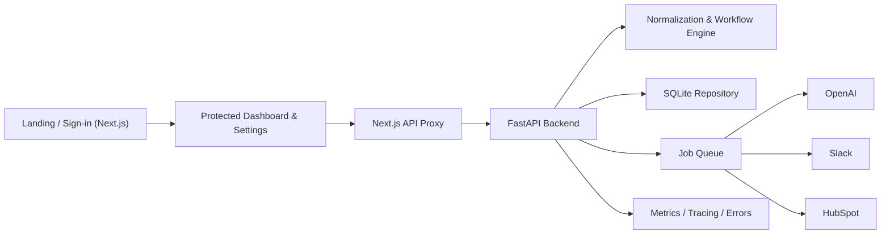

# RelayOps

RelayOps is an operations workflow platform that connects fragmented business inputs, structures the data, orchestrates follow-up actions, and tracks downstream execution across connected systems.

It is built as a real product-shaped portfolio project:

- Next.js frontend with protected routes
- FastAPI backend for workflow orchestration and integrations
- SQLite persistence with automatic local recovery
- session-based auth plus API-key access
- queued background processing for provider work
- integration diagnostics, runtime configuration visibility, and observability

## Product Overview

RelayOps is designed for teams that work across multiple systems and need one place to:

- intake operational requests
- normalize messy inbound data
- score urgency and recommend next actions
- generate clear workflow summaries
- track integration outcomes across CRM, communication, and finance systems

## Current Application Flow

- `/` landing page
- `/signin` workspace sign-in and workspace creation
- `/dashboard` protected operational workspace
- `/settings` protected integration status and runtime configuration
- `/metrics` Prometheus metrics endpoint

## Core Capabilities

- Structured workflow intake with typed request models
- Data normalization for inconsistent real-world payloads
- Workflow scoring and action generation
- AI-assisted summary enrichment
- Persistent workflow history and sync visibility
- Session auth with cookie-backed access
- API-key access for machine-to-machine requests
- Background job queue with retries and worker mode
- Integration status, runtime config visibility, and diagnostics
- Request throttling, request IDs, tracing hooks, and optional Sentry support

## Architecture



### Frontend

- `web/src/app/page.tsx`: landing page
- `web/src/app/signin/page.tsx`: sign-in route
- `web/src/app/dashboard/page.tsx`: protected dashboard route
- `web/src/app/settings/page.tsx`: protected settings route
- `web/src/app/api/[...path]/route.ts`: same-origin proxy from Next.js to FastAPI
- `web/src/components/`: UI shells for landing, sign-in, dashboard, and settings
- `web/src/lib/relayops.ts`: frontend API client
- `web/src/lib/session.ts`: route protection helpers

### Backend

- `app/main.py`: FastAPI app, auth, APIs, middleware, metrics, and lifecycle
- `app/models.py`: request, response, run, job, and integration models
- `app/services.py`: normalization and workflow generation
- `app/repository.py`: SQLite persistence for accounts, sessions, runs, and jobs
- `app/jobs.py`: queue processing and retry handling
- `app/worker.py`: standalone worker entry point
- `app/integrations.py`: OpenAI, Slack, and HubSpot integration logic
- `app/auth.py`: session and API-key account resolution
- `app/observability.py`: metrics, tracing, rate limiting, and error reporting
- `app/config.py`: runtime settings and `.env` loading
- `alembic/`: database migration environment and revisions

## Local Development

### 1. Backend

```bash
python3 -m venv .venv
source .venv/bin/activate
pip install -r requirements.txt
uvicorn app.main:app --host 127.0.0.1 --port 8022
```

### 2. Frontend

```bash
cd web
npm install
RELAYOPS_BACKEND_URL=http://127.0.0.1:8022 npm run dev -- --port 3006
```

Open:

- [http://localhost:3006](http://localhost:3006)

Recommended local routes:

- [http://localhost:3006/](http://localhost:3006/)
- [http://localhost:3006/signin](http://localhost:3006/signin)
- [http://localhost:3006/dashboard](http://localhost:3006/dashboard)
- [http://localhost:3006/settings](http://localhost:3006/settings)

## Default Local Account

- workspace: `RelayOps Demo Workspace`
- email: `demo@relayops.app`
- password: `relayops-demo-pass`
- API key: `relayops-demo-key`

## Authentication Model

- browser users sign in through `POST /api/auth/login`
- successful login creates an HttpOnly session cookie
- protected Next routes require a valid session
- `POST /api/auth/register` creates a new workspace and signs the user in
- `POST /api/auth/logout` clears the session
- backend APIs also accept `X-RelayOps-Api-Key` for non-browser usage

## Integrations

RelayOps currently supports these provider paths:

- OpenAI
- Slack incoming webhooks
- HubSpot CRM

Configuration is read from `.env` or process environment variables:

- `OPENAI_API_KEY`
- `OPENAI_MODEL`
- `SLACK_WEBHOOK_URL`
- `HUBSPOT_PRIVATE_APP_TOKEN`
- `HUBSPOT_BASE_URL`

The settings page shows:

- provider availability
- diagnostic results
- masked runtime configuration values

## Worker Mode

By default, queued jobs can be processed by the web process in local development.

For a split web/worker setup:

```bash
export RELAYOPS_RUN_JOBS_IN_WEB=0
uvicorn app.main:app --host 127.0.0.1 --port 8022
python -m app.worker
```

Relevant settings:

- `RELAYOPS_RUN_JOBS_IN_WEB`
- `RELAYOPS_WORKER_POLL_INTERVAL_MS`
- `RELAYOPS_RATE_LIMIT_PER_MINUTE`
- `RELAYOPS_SESSION_SECRET`
- `RELAYOPS_SESSION_MAX_AGE_SECONDS`
- `RELAYOPS_LOG_FORMAT`
- `RELAYOPS_TRACE_EXPORTER`
- `RELAYOPS_OTLP_ENDPOINT`
- `SENTRY_DSN`

## Database and Migrations

RelayOps uses SQLite locally and applies Alembic migrations on startup.

Run migrations manually:

```bash
alembic upgrade head
```

If the local SQLite file is corrupted, RelayOps now automatically:

- renames the broken database file with a `.corrupt-*` suffix
- creates a fresh local database
- boots normally instead of crashing on startup

## Validation

Backend:

```bash
python3 -m unittest discover -s tests -v
python3 -m compileall app tests
```

Frontend:

```bash
cd web
npm run lint
npm run build
```

Browser flow:

```bash
npm run test:e2e
```

The frontend suite covers:

- landing to sign-in to dashboard routing
- protected route redirects
- workflow submission from the dashboard
- integration diagnostics in settings
- Next.js proxy access to backend endpoints

## Key API Endpoints

- `GET /api/account`
- `GET /api/overview`
- `GET /api/health`
- `GET /api/integrations`
- `GET /api/integrations/runtime`
- `POST /api/integrations/check`
- `POST /api/auth/login`
- `POST /api/auth/register`
- `POST /api/auth/logout`
- `POST /api/workflows/execute`
- `POST /api/webhooks/intake`
- `GET /metrics`

## Example Workflow Request

```json
{
  "source": "hubspot",
  "company": "Atlas Retail Ops",
  "contact_name": "Laila Fathy",
  "email": "laila@atlasretail.ai",
  "pain_points": ["Manual reporting", "Slow approvals"],
  "requested_systems": ["HubSpot", "NetSuite", "Slack"],
  "monthly_revenue": "EUR 90k-140k",
  "urgency": "high",
  "notes": "Leadership needs a weekly summary."
}
```

## Troubleshooting

- `401 Unauthorized`
  - sign in again or verify the API key being sent
- `429 Too Many Requests`
  - reduce request volume or increase `RELAYOPS_RATE_LIMIT_PER_MINUTE` locally
- provider shown as `disabled`
  - check the corresponding env var in `.env`
- provider shown as `misconfigured`
  - verify the live credential or webhook format
- local startup fails because of SQLite corruption
  - restart the backend and allow the automatic recovery path to recreate the local database

## Repository Layout

- [app](/Volumes/PortableSSD/world/h6/app)
- [alembic](/Volumes/PortableSSD/world/h6/alembic)
- [tests](/Volumes/PortableSSD/world/h6/tests)
- [web](/Volumes/PortableSSD/world/h6/web)
- [.env.example](/Volumes/PortableSSD/world/h6/.env.example)
